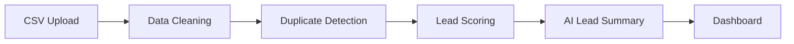
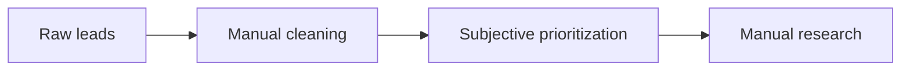
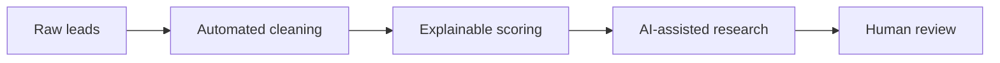

# LeadFlow AI — Smart Lead Prioritization Assistant

A small, end-to-end portfolio project that shows how basic data engineering
plus a light layer of AI can turn a messy CSV of sales leads into a cleaned,
deduplicated, explainably-scored, and AI-summarized worklist for a sales
rep.

It is intentionally simple — no auth, no queues, no Docker, no ML model.
Everything is readable in a sitting.

---

## 1. Business Problem

Sales teams routinely receive lead lists (from trade shows, content
downloads, cold-outreach vendors, etc.) that are:

- **Messy** — inconsistent company names, title abbreviations, missing
  fields.
- **Full of duplicates** — the same person entered twice with a typo, or
  the same email pasted in twice.
- **Unprioritized** — every lead looks the same until a rep manually
  researches each one, which doesn't scale.

Reps end up spending a large share of their time on manual data cleanup and
research instead of selling. LeadFlow AI automates the cleanup and
prioritization so a rep's first look at a lead list is already scored,
explained, and (optionally) pre-briefed.

---

## 2. Project Workflow



**As-is process (manual):**



**Improved process (LeadFlow AI):**



The AI never replaces the rep — it drafts a starting point, and every score
is broken into plain-English reasons so nothing is a black box.

---

## 3. Technology Stack

| Layer            | Technology                      |
|-------------------|----------------------------------|
| Backend API        | FastAPI                         |
| Data processing    | Pandas                          |
| Database           | SQLite via SQLAlchemy           |
| Frontend           | Streamlit                       |
| AI                  | Groq API (with offline mock fallback) |
| Fuzzy name matching | RapidFuzz (small, optional use) |
| Testing            | Pytest                          |

**Repository layout:**

```
leadflow-ai/
├── backend/
│   ├── main.py                # FastAPI app + routes
│   ├── database.py            # SQLAlchemy engine/session
│   ├── models.py               # Lead, AIResult ORM models
│   ├── schemas.py              # Pydantic request/response models
│   ├── cleaning.py             # Validation + normalization
│   ├── duplicate_detection.py  # Explainable duplicate rules
│   ├── scoring.py              # Deterministic 0-100 scoring
│   └── ai_service.py           # Groq call + mock fallback
├── frontend/
│   └── app.py                  # Streamlit UI (4 tabs)
├── data/
│   └── sample_leads.csv        # 100+ synthetic leads
├── tests/
│   ├── test_cleaning.py
│   └── test_scoring.py
├── requirements.txt
├── .env.example
└── README.md
```

---

## 4. Data Cleaning

`backend/cleaning.py` handles, per field:

- **Whitespace** — trimmed and internal double-spaces collapsed.
- **Email** — lowercased, trimmed, and shape-validated (invalid → `None`).
- **Phone** — stripped to digits only, leading US country code `1` dropped,
  so `+1 (555) 123-4567` and `555-123-4567` normalize identically.
- **Company** — lowercased, punctuation stripped, and common legal suffixes
  removed (`Pvt Ltd`, `Private Limited`, `Ltd`, `Limited`, `LLC`, `Inc`).
  - `"ACME Private Limited"` → `"acme"`
  - `"Acme Pvt. Ltd."` → `"acme"`
- **Job title** — common abbreviations expanded (`CTO` → `Chief Technology
  Officer`, `VP Engineering` → `Vice President of Engineering`, `Mgr` →
  `Manager`, etc.), then classified into a **seniority** bucket: `C-Level`,
  `Vice President`, `Director`, `Manager`, `Individual Contributor`, or
  `Student or Unknown`.
- **Missing values** — every field is nullable; a row is only dropped if it
  has no name, email, *and* phone (nothing to identify the lead by). Every
  drop is reported back in the upload response as a validation error.

---

## 5. Duplicate Detection

Kept intentionally simple and explainable — no ML, no vector search.
`backend/duplicate_detection.py` flags two leads as probable duplicates if
any of the following match:

1. Same normalized email, or
2. Same normalized phone, or
3. Same normalized name **and** same normalized company.

As a small bonus, RapidFuzz catches near-identical names at the same
normalized company (e.g. `"Jon Smith"` vs `"John Smith"`), so the exercise
of "duplicate people with slightly different names" in the sample data is
actually caught.

Matches are grouped with a union-find so duplicate chains (A↔B via email,
B↔C via phone) land in one group. Every duplicate lead is returned with:

- `is_duplicate` flag
- `duplicate_group` id (e.g. `DUP-003`)
- `duplicate_reason` — a plain-English explanation, e.g. `"Same normalized
  email"` or `"Same normalized name and company"`.

---

## 6. Lead Scoring

Deterministic, 100-point, fully explainable — every point is traceable to
one plain-English reason (see `backend/scoring.py`).

| Category            | Max points | Rule                                                                 |
|----------------------|-----------|-----------------------------------------------------------------------|
| Job seniority         | 30 | C-Level 30 · VP 25 · Director 20 · Manager 12 · IC 6 · Student/Unknown 0 |
| Company size           | 25 | ≥1000: 25 · 500-999: 20 · 100-499: 15 · 20-99: 8 · <20/unknown: 2       |
| Target industry         | 20 | SaaS / Cloud / FinTech / Healthcare Technology / E-commerce / AI: 20, else 5 |
| Activity recency        | 15 | ≤7d: 15 · ≤30d: 10 · ≤90d: 5 · older/unknown: 0                       |
| Email quality            | 10 | Corporate: 10 · Public/free (Gmail, etc.): 3 · missing/invalid: 0     |

**Priority:** High 75-100 · Medium 45-74 · Low 0-44

Every scored lead carries its `score_breakdown` (points per category) plus
`positive_reasons` and `negative_reasons` lists, so the dashboard/explorer
can show *why* a lead scored the way it did without re-deriving anything.

---

## 7. AI Usage

`backend/ai_service.py` calls the **Groq API** to produce a structured lead
brief: `lead_summary`, `why_this_lead_matters`, `suggested_outreach_angle`,
and 3 `discovery_questions`.

- The prompt instructs the model to use **only** the uploaded lead fields —
  no invented company news, funding, revenue, tech stack, or other
  real-world facts.
- Every AI response carries the disclaimer: *"AI-generated recommendation
  based only on uploaded lead data. Human review is required."*
- **If `GROQ_API_KEY` is not set, the app automatically falls back to a
  deterministic mock brief** built from the same lead fields, so the whole
  project runs end to end with zero external dependencies.
- Provider errors are mapped to distinct HTTP statuses instead of a blanket
  500: Groq `429` → API `429`, timeout → `504`, provider unreachable/`5xx`
  → `503`, anything else unexpected → `500`.

---

## 8. Project Limitations

- Single-user, no authentication — anyone with local access to the app can
  see/upload leads.
- Each CSV upload **replaces** the previous dataset (kept simple on
  purpose — no multi-tenant or historical uploads).
- Duplicate detection and scoring are rule-based, not ML-based — precise
  and explainable, but will miss subtler duplicates or signals a trained
  model might catch.
- Sample data is 100% synthetic; any resemblance to a real company/person
  is coincidental. No claims of real business impact are made — the "time
  saved" figure on the dashboard is a stated estimate based on assumed
  manual-research minutes, not measured data.
- The mock AI fallback is deterministic and template-based, not a real
  model — it exists purely so the app works without an API key.

---

## 9. Setup Instructions

```bash
cd leadflow-ai
python -m venv .venv

# Windows
.venv\Scripts\activate
# macOS/Linux
source .venv/bin/activate

pip install -r requirements.txt
cp .env.example .env   # optionally add your GROQ_API_KEY
```

### Run the backend

```bash
uvicorn backend.main:app --reload --port 8000
```

API docs: http://localhost:8000/docs

### Run the frontend

In a second terminal (with the same venv activated):

```bash
streamlit run frontend/app.py
```

Opens at http://localhost:8501. Upload `data/sample_leads.csv` in the
"Upload Leads" tab to try the full workflow.

### Run the tests

```bash
pytest tests/ -v
```
